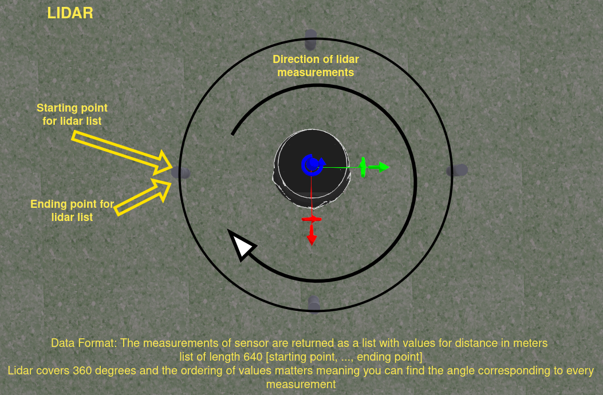

# Robot API Method Reference
This document provides a detailed reference for each method available in the Robot class.

## Environment Methods
### get_simulator() -> bool
Returns true when running in the simulator.
### get_realistic() -> bool
Returns true when running in the realistic mode.

## Time Methods
### get_time() -> float
Returns the current elapsed time from the start of the robot's operation in seconds. This provides a way to track how long the robot has been running.

## LiDAR Methods
### get_lidar_range_list() -> list
Returns a list of distance measurements in meters from the robot's LiDAR sensor. The measurements are ordered clockwise when viewed from above, starting from the robot's right side (90 degrees clockwise from the front). This gives you a circular scan of distances to objects around the robot.
### get_lidar_point_cloud() -> list
Returns three-dimensional point cloud data from the LiDAR sensor. Each point in the returned list is represented as an object with 'x', 'y', and 'z' coordinates (in meters) relative to the sensor's position. This provides a detailed 3D representation of the robot's surroundings.

## Motor Control and Feedback Methods
### set_left_motor_velocity(speed: float) -> None
Sets the rotational speed of the left motor in radians per second. A positive speed makes the wheel rotate forward, while a negative speed makes it rotate backward. This allows direct control of the left wheel's velocity.
### set_right_motor_velocity(speed: float) -> None
Sets the rotational speed of the right motor in radians per second. A positive speed makes the wheel rotate forward, while a negative speed makes it rotate backward. This allows direct control of the right wheel's velocity.
### set_left_motor_torque(torque: float) -> None
Controls the left motor by applying a specified torque in Newton-meters (Nm). A positive torque creates forward movement, while a negative torque creates backward movement. Setting the torque to zero stops the motor. This provides lower-level control over the motor's force output.
### set_right_motor_torque(torque: float) -> None
Controls the right motor by applying a specified torque in Newton-meters (Nm). A positive torque creates forward movement, while a negative torque creates backward movement. Setting the torque to zero stops the motor. This provides lower-level control over the motor's force output.
### get_left_motor_encoder_ticks() -> int
Returns the number of ticks counted by the left wheel's encoder as an integer. Based on the robot's specifications, there are 508.8 ticks per complete wheel rotation. This helps track the precise rotation of the left wheel.
### get_right_motor_encoder_ticks() -> int
Returns the number of ticks counted by the right wheel's encoder as an integer. Based on the robot's specifications, there are 508.8 ticks per complete wheel rotation. This helps track the precise rotation of the right wheel.

## IMU Method
### get_orientation() -> float
Returns the robots Yaw value from Inertial Measurement unit, this is the robots current orientation angle in world frame. The value is a float that ranges from [-π; π] corresponding to 360 degrees.

## Camera Methods
### get_camera_rgb_image() -> np.ndarray
Returns an image from the robot's RGB camera as a NumPy array in BGRA format (Blue, Green, Red, Alpha channels). The array has dimensions (height, width, 4), where the last dimension represents the BGRA channels (Blue, Green, Red, Alpha). The values are unsigned 8-bit integers.
### get_camera_depth_image() -> np.ndarray
Returns depth image data from the robot's depth camera as a 2D NumPy array with dimensions (height, width). Each pixel value represents the distance to objects in the scene as a floating-point number.
### get_camera_field_of_view() -> float
Returns the cameras horizontal field of view in radians, the value is a float.

## Constants
### WHEEL_BASE
Turtlebot global variable that contains the robots wheel base in meters.
### WHEEL_DIAMETER
Turtlebot global variable that contains the robot wheel diameter in meters.

## Infrared Sensor Methods
### get_ir_intensities_list() -> list
Returns a list containing all seven infrared sensor readings in the order: [left, side_left, center_left, center, center_right, side_right, right]. Each value ranges from 0 (far) to 4000 (close).
### get_ir_intensity_left() -> float
Returns the reading from the leftmost infrared sensor. Values range from 0 (far) to 4000 (close), indicating the intensity of reflected infrared light.
### get_ir_intensity_side_left() -> float
Returns the reading from the second leftmost infrared sensor. Values range from 0 (far) to 4000 (close), indicating the intensity of reflected infrared light.
### get_ir_intensity_center_left() -> float
Returns the reading from the third leftmost infrared sensor. Values range from 0 (far) to 4000 (close), indicating the intensity of reflected infrared light.
### get_ir_intensity_center() -> float
Returns the reading from the center infrared sensor. Values range from 0 (far) to 4000 (close), indicating the intensity of reflected infrared light.
### get_ir_intensity_center_right() -> float
Returns the reading from the third rightmost infrared sensor. Values range from 0 (far) to 4000 (close), indicating the intensity of reflected infrared light.
### get_ir_intensity_side_right() -> float
Returns the reading from the second rightmost infrared sensor. Values range from 0 (far) to 4000 (close), indicating the intensity of reflected infrared light.
### get_ir_intensity_right() -> float
Returns the reading from the rightmost infrared sensor. Values range from 0 (far) to 4000 (close), indicating the intensity of reflected infrared light.
